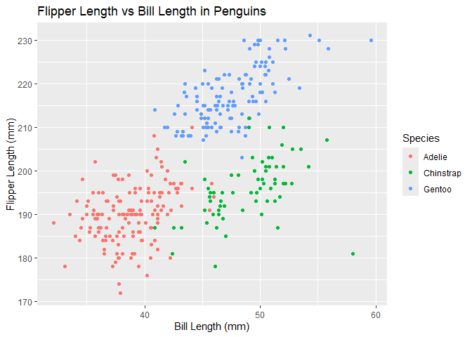

p8105_hw1_ns3782
================
NSK
2024-09-21

## Problem 1

``` r
## Initialising project libraries and data

library(palmerpenguins)
library(tidyverse)
```

    ## ── Attaching core tidyverse packages ──────────────────────── tidyverse 2.0.0 ──
    ## ✔ dplyr     1.1.4     ✔ readr     2.1.5
    ## ✔ forcats   1.0.0     ✔ stringr   1.5.1
    ## ✔ ggplot2   3.5.1     ✔ tibble    3.2.1
    ## ✔ lubridate 1.9.3     ✔ tidyr     1.3.1
    ## ✔ purrr     1.0.2     
    ## ── Conflicts ────────────────────────────────────────── tidyverse_conflicts() ──
    ## ✖ dplyr::filter() masks stats::filter()
    ## ✖ dplyr::lag()    masks stats::lag()
    ## ℹ Use the conflicted package (<http://conflicted.r-lib.org/>) to force all conflicts to become errors

``` r
data("penguins", package = "palmerpenguins")
```

The penguins dataset contains data on 344 penguins, with 8 variables
providing descriptive information for each penguin. These variables
include species (Adelie, Gentoo, Chinstrap), island (Torgersen, Biscoe,
Dream), bill length (mm), bill depth (mm), flipper length (mm), body
mass (g), sex, and year (year data was collected).

The mean flipper length of the penguins is 200.92 mm.

``` r
## Scatterplot of Flipper Length vs Bill Length in Penguins

ggplot(penguins, aes(x = bill_length_mm, y = flipper_length_mm, color = species)) +
  geom_point() +
  labs(title = "Flipper Length vs Bill Length in Penguins",
       x = "Bill Length (mm)",
       y = "Flipper Length (mm)",
       color = "Species")
```

    ## Warning: Removed 2 rows containing missing values or values outside the scale range
    ## (`geom_point()`).

<!-- -->

``` r
## Save scatterplot

ggsave("penguin_scatter.png", width = 8, height = 6)
```

    ## Warning: Removed 2 rows containing missing values or values outside the scale range
    ## (`geom_point()`).

## Problem 2

``` r
## Creating dataframe with numeric, logical and character vectors

problem2_df = tibble(
  norm_samp = rnorm(10),
  vec_logical = norm_samp > 0,
  vec_char = letters[1:10],
  vec_factor = factor(c("Level1", "Level2", "Level3", "Level1", "Level2", "Level3", "Level1", "Level2", "Level3", "Level1"))
)
```

Attempting to take the mean of each variable in problem2_df dataframe.

``` r
## Mean of numeric vector
mean_numeric = mean(pull(problem2_df, norm_samp))

## Mean of logical vector
mean_logical = mean(pull(problem2_df, vec_logical))

## Mean of character vector
mean_char = mean(pull(problem2_df, vec_char))
```

    ## Warning in mean.default(pull(problem2_df, vec_char)): argument is not numeric
    ## or logical: returning NA

``` r
## Mean of factor vector
mean_factor = mean(pull(problem2_df, vec_factor))
```

    ## Warning in mean.default(pull(problem2_df, vec_factor)): argument is not numeric
    ## or logical: returning NA

We can see that the numeric and logical vectors return numeric values.
In the case of the logical vector from problem2_df, this is the
proportion of TRUE values as R computes TRUE as 1 and FALSE as 0.

vec_char produces an error message as it is not possible for R to
calculate the mean of character values. Similarly, attempts to calculate
the average directly for vec_factor does not work as factors are
categorical.
